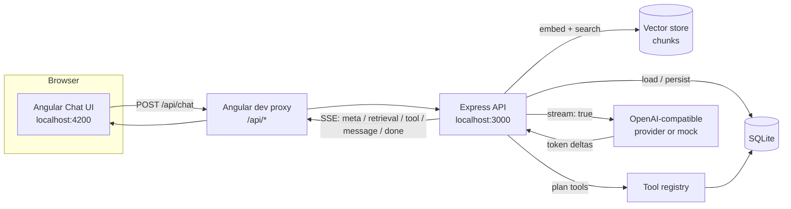

# Angular Conversational AI

A full-stack, production-shaped starter for building a **streaming conversational AI** application. The frontend is **Angular** (standalone components + signals + RxJS), the backend is **Node.js + Express**, and responses stream to the browser with **Server-Sent Events (SSE)**.

It is the companion repository for the article **“Building Conversational AI with Angular: A Practical Guide with Node.js and Streaming.”**

> Read the article: **[Building Conversational AI with Angular: A Practical Guide with Node.js and Streaming](ADD_YOUR_MEDIUM_ARTICLE_URL_HERE)**

<!-- Replace ADD_YOUR_MEDIUM_ARTICLE_URL_HERE with the published article URL. -->


---

## Table of contents

- [What this project is](#what-this-project-is)
- [Features](#features)
- [Architecture](#architecture)
- [Tech stack](#tech-stack)
- [Project structure](#project-structure)
- [Prerequisites](#prerequisites)
- [Quick start (one command)](#quick-start-one-command)
- [Demo credentials](#demo-credentials)
- [Using the app](#using-the-app)
- [Configuration](#configuration)
- [Connecting a real model](#connecting-a-real-model)
- [API reference](#api-reference)
- [SSE event contract](#sse-event-contract)
- [How each feature works](#how-each-feature-works)
- [Verifying it works](#verifying-it-works)
- [Production checklist](#production-checklist)
- [Troubleshooting](#troubleshooting)

---

## What this project is

A minimal but complete reference implementation of a conversational AI product that you can run immediately and build on:

- A chat workspace in **Angular 19** with login, conversation history, and live streaming.
- An **Express** API that owns authentication, persistence, retrieval, tool execution, and provider calls.
- A **vendor-neutral provider layer** that speaks the OpenAI-compatible `chat/completions` API (OpenAI, Azure OpenAI, Groq, Together, Ollama, LM Studio, and similar).
- A built-in **mock provider** so the entire app works end to end — including RAG and tool calling — without any API key.
- Real **SQLite** persistence for users, conversations, messages, knowledge documents, chunks, and tool runs.
- A **Prometheus-compatible metrics endpoint** and structured JSON logs for observability.

Everything is dependency-light and runs locally with no external services required.

## Features

| Area | What is included |
| ---- | ---------------- |
| **Streaming** | Token-by-token SSE with `meta`, `retrieval`, `tool`, `message`, `done`, and `error` events; heartbeats; client abort propagation. |
| **Authentication** | Email + password registration and login, scrypt password hashing, JWT bearer tokens, protected routes. |
| **Conversations** | Database-backed history per user, sidebar list, load/delete, auto-titling, full history sent to the model. |
| **RAG** | Document ingestion, chunking, embeddings, cosine-similarity vector search, retrieved-context injection, and a knowledge-base UI. |
| **Tool calling** | Provider-driven tool planning and execution with a `get_current_time`, `calculator`, and `search_knowledge_base` demo tool. |
| **Observability** | Structured JSON logs with request ids, in-process metrics, `/api/metrics` (Prometheus) and `/api/stats` (JSON). |
| **Providers** | OpenAI-compatible streaming provider plus an offline mock provider with heuristic tool planning. |
| **DX** | One command to install, one command to run both apps, mock mode for zero-config demos. |

## Architecture



Angular renders and manages UI state. Express owns secrets, business logic, persistence, retrieval, and tool execution. The model only ever sees what the backend chooses to send.

## Tech stack

| Layer | Technology |
| ----- | ---------- |
| Frontend | Angular 19 (standalone components, signals, RxJS), TypeScript, Fetch + `ReadableStream` |
| Backend | Node.js 18+, Express 4, Zod validation |
| Database | SQLite via `better-sqlite3` |
| Auth | `jsonwebtoken` (JWT) + Node `crypto` scrypt hashing |
| AI | OpenAI-compatible `chat/completions` and `embeddings`; offline mock fallback |
| Transport | Server-Sent Events (SSE) |
| Observability | Structured JSON logs + Prometheus text metrics |
| Tooling | Angular CLI, concurrently, ESLint/Prettier config |

## Project structure

```text
angular-conversational-ai/
├── client/                              # Angular application
│   ├── src/app/
│   │   ├── core/
│   │   │   ├── api.service.ts           # fetch wrapper + SSE stream parser
│   │   │   ├── session.service.ts       # token + user state (signals)
│   │   │   ├── models.ts                # shared types
│   │   │   └── workspace.service.ts     # conversations, documents, tools
│   │   ├── chat/
│   │   │   ├── chat.component.{ts,html,css}   # chat workspace + knowledge drawer
│   │   ├── login/
│   │   │   ├── login.component.{ts,html,css}  # sign in / register
│   │   └── app.component.{ts,html,css}  # auth-aware shell
│   ├── proxy.conf.json                  # /api -> http://localhost:3000
│   └── package.json
├── server/                             # Node.js + Express API
│   ├── src/
│   │   ├── auth/passwords.js            # scrypt hash/verify
│   │   ├── db/
│   │   │   ├── index.js                 # SQLite connection
│   │   │   ├── repositories.js          # data access
│   │   │   ├── schema.sql               # tables + indexes
│   │   │   └── seed.js                  # demo user + sample documents
│   │   ├── middleware/                  # request context, auth, error handling
│   │   ├── observability/               # logger + metrics registry
│   │   ├── providers/                   # mock + OpenAI-compatible providers
│   │   ├── rag/                         # embeddings, chunking, ingestion, search
│   │   ├── routes/                      # auth, conversations, chat, documents, tools, observability
│   │   ├── tools/                       # tool definitions + execution
│   │   ├── app.js                       # Express app
│   │   └── server.js                    # bootstrap + graceful shutdown
│   ├── .env.example
│   └── package.json
├── .editorconfig
├── .gitignore
├── LICENSE                              # MIT
├── package.json                         # one-command runner for both apps
└── README.md
```

## Prerequisites

- **Node.js 18 or newer** (Node 20 LTS recommended; the project uses the built-in `fetch` and `better-sqlite3` v11 prebuilds).
- npm 9+.

No database server, vector database, or API key is required to run the demo.

## Quick start (one command)

From the repository root:

```bash
npm run install:all
```

Then start **both** the backend and the frontend with a single command:

```bash
npm run dev
```

`npm start` is an alias for the same thing. This runs the Express API on `http://localhost:3000` and the Angular dev server on `http://localhost:4200` in one terminal.

Open **http://localhost:4200** and sign in with the demo account below.

Optionally create a server environment file (defaults work without it):

```bash
# macOS / Linux
cp server/.env.example server/.env

# Windows PowerShell
Copy-Item server\.env.example server\.env
```

### Running the apps separately

```bash
npm run dev:server   # Express API  -> http://localhost:3000
npm run dev:client   # Angular app  -> http://localhost:4200
```

### Building for production

```bash
npm run build        # outputs client/dist/client
```

## Demo credentials

The server seeds a demo user and a sample knowledge base on first run:

| Field | Value |
| ----- | ----- |
| **User id** | assigned on seed (a UUID; visible in `/api/auth/me` and the database) |
| **Email** | `demo@example.com` |
| **Password** | `password123` |

The demo account is preloaded with three documents — **Refund Policy**, **Remote Work Policy**, and **Product FAQ** — so RAG and tool calling can be demonstrated immediately. You can also register a new account; new accounts are seeded with the same sample documents.

## Using the app

1. **Sign in** with `demo@example.com` / `password123` (the login screen is pre-filled with these).
2. Ask a normal question, for example: `Explain what this app does.`
3. Turn on **RAG** and ask: `What is the refund policy?` — watch the retrieved context appear, then the streamed answer.
4. Turn on **Tools** and ask: `What is (12 + 8) * 3?` or `What time is it?` — the tool call is shown inline before the answer.
5. Open **Knowledge base** in the sidebar to add your own document, then ask a question about it with RAG enabled.
6. Create, select, and delete conversations from the sidebar; history is loaded from the database.

The **RAG** and **Tools** toggles send `useRag` / `useTools` with each request, so you can show exactly when retrieval and tool calling happen.

## Configuration

All backend configuration is environment based. Copy `server/.env.example` to `server/.env` and adjust as needed.

| Variable | Default | Purpose |
| -------- | ------- | ------- |
| `PORT` | `3000` | API port. |
| `NODE_ENV` | `development` | Runtime environment. |
| `LOG_LEVEL` | `info` | `debug`, `info`, `warn`, or `error`. |
| `OPENAI_API_KEY` | _empty_ | When empty, the mock provider is used. |
| `OPENAI_MODEL` | `gpt-4o-mini` | Chat model. |
| `OPENAI_BASE_URL` | `https://api.openai.com/v1` | Any OpenAI-compatible base URL. |
| `JWT_SECRET` | `dev-secret-change-me` | **Change in production.** |
| `JWT_TTL` | `7d` | Token lifetime. |
| `DATABASE_FILE` | `./data/app.db` | SQLite file (created automatically). |
| `RAG_TOP_K` | `4` | Number of chunks retrieved. |
| `RAG_CHUNK_SIZE` | `320` | Approximate chunk size in characters. |
| `RAG_REAL_EMBEDDINGS` | `false` | `true` uses OpenAI embeddings instead of local hashing embeddings. |
| `OPENAI_EMBEDDING_MODEL` | `text-embedding-3-small` | Embedding model when real embeddings are enabled. |
| `AGENT_MAX_TOOL_STEPS` | `3` | Maximum tool-planning iterations per turn. |
| `AGENT_HISTORY_LIMIT` | `20` | Messages sent to the model per turn. |

## Connecting a real model

Set a key in `server/.env` and restart the server:

```env
OPENAI_API_KEY=sk-your-key
OPENAI_MODEL=gpt-4o-mini
OPENAI_BASE_URL=https://api.openai.com/v1
```

Because the provider layer is OpenAI-compatible, you can point it at other endpoints:

| Provider | `OPENAI_BASE_URL` | `OPENAI_MODEL` example |
| -------- | ----------------- | ---------------------- |
| OpenAI | `https://api.openai.com/v1` | `gpt-4o-mini` |
| Groq | `https://api.groq.com/openai/v1` | `llama-3.3-70b-versatile` |
| Ollama (local) | `http://localhost:11434/v1` | `llama3.1` |
| LM Studio (local) | `http://localhost:1234/v1` | `local-model` |

`GET /api/health` reports the active provider, model, and embedding source.

> Never commit `server/.env`. It is excluded by `.gitignore`, along with the local `server/data/` SQLite directory.

## API reference

All routes are prefixed with `/api`. Protected routes require an `Authorization: Bearer <token>` header.

### Authentication

| Method | Path | Body | Description |
| ------ | ---- | ---- | ----------- |
| `POST` | `/api/auth/register` | `{ email, password, name? }` | Create an account and return a token. |
| `POST` | `/api/auth/login` | `{ email, password }` | Sign in and return a token. |
| `GET` | `/api/auth/me` | — | Return the current user. |

### Conversations (protected)

| Method | Path | Description |
| ------ | ---- | ----------- |
| `GET` | `/api/conversations` | List the user's conversations, newest first. |
| `POST` | `/api/conversations` | Create a conversation (`{ title? }`). |
| `GET` | `/api/conversations/:id` | Conversation with its messages and tool runs. |
| `PATCH` | `/api/conversations/:id` | Rename (`{ title }`). |
| `DELETE` | `/api/conversations/:id` | Delete a conversation and its data. |

### Chat (protected, streams SSE)

| Method | Path | Description |
| ------ | ---- | ----------- |
| `POST` | `/api/chat` | Send a message and stream the reply. |

Request body:

```json
{
  "conversationId": "optional-existing-id",
  "content": "What is the refund policy?",
  "useRag": true,
  "useTools": true
}
```

If `conversationId` is omitted, a new conversation is created automatically.

### Knowledge base (protected)

| Method | Path | Description |
| ------ | ---- | ----------- |
| `GET` | `/api/documents` | List documents. |
| `POST` | `/api/documents` | Ingest a document (`{ title, content }`); chunks and embeds it. |
| `DELETE` | `/api/documents/:id` | Remove a document and its chunks. |

### Tools and observability (public)

| Method | Path | Description |
| ------ | ---- | ----------- |
| `GET` | `/api/tools` | List available tools and their JSON schemas. |
| `GET` | `/api/health` | Service health and active provider. |
| `GET` | `/api/metrics` | Prometheus text metrics. |
| `GET` | `/api/stats` | Metrics as JSON. |

## SSE event contract

`POST /api/chat` responds with `Content-Type: text/event-stream`. Each event is `event:` + `data:` followed by a blank line:

```text
event: meta
data: {"conversationId":"...","userMessageId":"...","provider":"mock","title":"What is the refund policy?"}

event: retrieval
data: {"matches":[{"document":"Refund Policy","score":0.42,"excerpt":"Customers can ..."}]}

event: tool
data: {"id":"...","name":"search_knowledge_base","arguments":{"query":"..."},"result":"{...}"}

event: message
data: {"content":"Here "}

event: message
data: {"content":"is what "}

event: done
data: {"conversationId":"...","messageId":"..."}
```

On failure the stream emits a terminal error event:

```text
event: error
data: {"message":"Provider error 401: ..."}
```

Event reference:

| Event | When | Payload highlights |
| ----- | ---- | ------------------ |
| `meta` | Once, at the start | `conversationId`, `userMessageId`, `provider`, `title` |
| `retrieval` | When RAG is on and chunks match | `matches[]` with `document`, `score`, `excerpt` |
| `tool` | Before each tool execution | `id`, `name`, `arguments`, `result` |
| `message` | For each streamed token chunk | `content` |
| `done` | Once, at the end | `conversationId`, `messageId` |
| `error` | On failure | `message` |

## How each feature works

### Authentication

Registration and login hash passwords with Node `crypto.scrypt` and issue a JWT signed with `JWT_SECRET` (`server/src/auth/passwords.js`, `server/src/middleware/auth.js`). The Angular `SessionService` stores the token in `localStorage`, restores the session on load via `/api/auth/me`, and `ApiService` attaches it to every request.

### Database-backed conversations

SQLite stores users, conversations, messages, documents, chunks, and tool runs (`server/src/db/schema.sql`). On each turn the backend loads recent history (`AGENT_HISTORY_LIMIT`), appends the user message, streams the answer, and persists both messages plus every tool run. The client sends only `{ conversationId, content }` — the backend owns all context.

### RAG

Documents are split into chunks, embedded, and stored. On a RAG-enabled turn the backend embeds the question, ranks chunks with cosine similarity, and injects the top matches as a system message. By default embeddings are computed locally with a deterministic hashing embedding (`server/src/rag/embeddings.js`), so RAG works offline; set `RAG_REAL_EMBEDDINGS=true` to use the provider's embeddings endpoint instead. The retrieved context is streamed back as a `retrieval` event for transparency.

### Tool calling

The backend exposes controlled tools (`get_current_time`, `calculator`, `search_knowledge_base`) with JSON schemas (`server/src/tools/index.js`). Before streaming, the provider is asked to plan tool calls; the backend executes them, records a `tool_run`, streams a `tool` event, and feeds the results back to the model for the final answer. The mock provider uses heuristics to plan tools so the flow works without a key, and the `calculator` uses an isolated `node:vm` context with a strict numeric allowlist.

### Observability

`server/src/observability/logger.js` emits one JSON log line per event with a request id (`x-request-id`), and `server/src/observability/metrics.js` records counters and latency histograms. `GET /api/metrics` renders them in Prometheus text format, so the demo can be scraped by Prometheus or inspected with `curl`. Metrics include `http_requests_total`, `http_request_duration_seconds`, `chat_streams_total`, `chat_stream_duration_seconds`, `tool_calls_total`, `tokens_total`, and RAG counters.

## Verifying it works

With the server running, check the essentials:

```bash
# Health and provider
curl http://localhost:3000/api/health

# Metrics (Prometheus format)
curl http://localhost:3000/api/metrics

# Sign in and capture a token
curl -X POST http://localhost:3000/api/auth/login \
  -H "Content-Type: application/json" \
  -d "{\"email\":\"demo@example.com\",\"password\":\"password123\"}"

# Stream a chat response
curl -N -X POST http://localhost:3000/api/chat \
  -H "Content-Type: application/json" \
  -H "Authorization: Bearer <token>" \
  -d "{\"content\":\"What is the refund policy?\",\"useRag\":true,\"useTools\":true}"
```

Through the Angular dev server, the same calls work on port `4200` (e.g. `http://localhost:4200/api/health`) because the dev proxy forwards `/api/*` to the backend.

## Production checklist

- [ ] Replace `JWT_SECRET` and disable demo seeding.
- [ ] Serve the API over HTTPS and the client from the same origin.
- [ ] Add rate limiting per user/IP (e.g. `express-rate-limit`).
- [ ] Validate and cap request sizes (already `1mb`) and message length (already `8000`).
- [ ] Move from SQLite to a managed Postgres and use a real vector store for RAG at scale.
- [ ] Add provider retries with backoff and timeouts.
- [ ] Track token usage and cost per user/tenant.
- [ ] Add content safety and moderation.
- [ ] Export logs/traces to your observability stack and scrape `/api/metrics`.
- [ ] Add tests around the orchestrator and providers.

## Troubleshooting

- **Streaming hangs:** confirm the API is on port `3000` and that `client/proxy.conf.json` targets it.
- **CORS errors:** in development call the API through `/api` (the proxy), not `http://localhost:3000` directly.
- **`Provider error 401`:** `OPENAI_API_KEY` is missing or invalid.
- **Local model not found:** a local server (Ollama/LM Studio) must be running at `OPENAI_BASE_URL`.
- **Reset the database:** stop the server and delete `server/data/` to reseed the demo user and documents.
- **Native install issues:** `better-sqlite3` ships prebuilt binaries for Node LTS; use Node 18/20/22 LTS.

## License

Released under the [MIT License](./LICENSE). © 2026 Anurag Srivastava.
