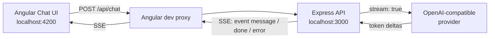

# Angular Conversational AI

A full-stack, production-shaped starter for building a **streaming conversational AI** chat UI. Built with **Angular** on the front end and **Node.js + Express** on the back end, using **Server-Sent Events (SSE)** to stream model tokens to the browser in real time.

> Read the article: **[Building Conversational AI with Angular: A Practical Guide with Node.js and Streaming](ADD_YOUR_MEDIUM_ARTICLE_URL_HERE)**

<!-- Replace ADD_YOUR_MEDIUM_ARTICLE_URL_HERE with the published article URL. -->


---

## What this project is

A minimal but complete reference implementation of a conversational AI product:

- A chat interface in Angular 19 (standalone components + RxJS).
- An Express API that receives the conversation and streams the reply back.
- A vendor-neutral provider layer that speaks the **OpenAI-compatible `chat/completions` API** (works with OpenAI, Azure OpenAI, Groq, Together, Ollama, LM Studio, and similar).
- A built-in **mock streamer** so the app runs end-to-end even before you add an API key.
- Correct SSE handling on both sides: incremental chunks, a terminal `done` event, an `error` event, heartbeats, and client-abort support.

Use it as a starting point for your own assistant, chatbot, or AI-powered product.

## Architecture



In development the Angular dev server proxies `/api/*` to the Express server, so the browser talks to a single origin and you avoid CORS entirely. In production you would put both behind the same origin (static hosting plus the API).

## Features

- Streaming responses rendered token by token.
- Conversation history sent with every request (stateless server).
- Mock mode with no API key required.
- OpenAI-compatible: swap providers with environment variables.
- Stop button that aborts the stream via `AbortController`.
- Server heartbeats and `X-Accel-Buffering: no` for proxies/nginx.
- Request validation, JSON body limits, and graceful shutdown.
- MIT licensed and ready to fork.

## Project structure

```text
angular-conversational-ai/
├── client/                     # Angular 19 application
│   ├── src/app/
│   │   ├── app.component.*     # Chat UI
│   │   └── chat.service.ts     # fetch + SSE client
│   ├── proxy.conf.json         # Dev proxy: /api -> :3000
│   └── package.json
├── server/                     # Node.js + Express API
│   ├── src/server.js           # Routes + SSE + providers
│   ├── .env.example            # Environment template
│   └── package.json
├── .editorconfig
├── .gitignore
├── LICENSE                     # MIT
├── package.json                # Root scripts to run both apps
└── README.md
```

## Prerequisites

- **Node.js 18 or newer** (uses the built-in `fetch`). Node 20+ recommended.
- npm 9+.

## Quick start

From the repository root:

```bash
npm run install:all
```

Then create the server environment file:

```bash
cp server/.env.example server/.env
```

Leave `OPENAI_API_KEY` empty to use the built-in mock streamer, then start both apps together:

```bash
npm run dev
```

Open **http://localhost:4200** and send a message. You do not need an API key to see streaming in action.

### Running the apps separately

```bash
npm run dev:server   # Express API on http://localhost:3000
npm run dev:client   # Angular app on http://localhost:4200
```

## Connecting a real model

Edit `server/.env`:

```env
PORT=3000
OPENAI_API_KEY=sk-your-key
OPENAI_MODEL=gpt-4o-mini
OPENAI_BASE_URL=https://api.openai.com/v1
```

Because the provider is OpenAI-compatible, you can point `OPENAI_BASE_URL` at any compatible endpoint. Examples:

| Provider            | `OPENAI_BASE_URL`                      | `OPENAI_MODEL` example        |
| ------------------- | -------------------------------------- | ----------------------------- |
| OpenAI              | `https://api.openai.com/v1`            | `gpt-4o-mini`                 |
| Groq                | `https://api.groq.com/openai/v1`       | `llama-3.3-70b-versatile`     |
| Ollama (local)      | `http://localhost:11434/v1`            | `llama3.1`                    |
| LM Studio (local)   | `http://localhost:1234/v1`             | `local-model`                 |

Restart the server after changing `.env`. The `/api/health` endpoint reports which provider is active.

> Never commit `server/.env`. It is already excluded by `.gitignore`.

## API reference

### `POST /api/chat`

Request body:

```json
{
  "messages": [
    { "role": "user", "content": "Explain closures in JavaScript" }
  ]
}
```

`role` may be `system`, `user`, or `assistant`. The response is a `text/event-stream`:

```text
event: message
data: {"content":"Closures "}

event: message
data: {"content":"capture variables "}

event: done
data: {}
```

On failure, the stream emits an `error` event:

```text
event: error
data: {"message":"Provider error 401: ..."}
```

### `GET /api/health`

```json
{ "ok": true, "provider": "mock", "model": "gpt-4o-mini" }
```

## How streaming works

1. The Angular client appends the user message and immediately renders an empty assistant bubble.
2. It `POST`s the full message history to `/api/chat` and reads `response.body` as a stream.
3. The server opens the upstream model request with `stream: true` and forwards each content delta as an SSE `message` event.
4. The client parses events on `\n\n` boundaries and appends each `content` chunk to the active bubble.
5. A terminal `done` event (or `error`) closes the loop.

**Why SSE instead of WebSockets?** Chat streaming is unidirectional: the server pushes tokens, the client only sends the initial request. SSE rides on plain HTTP, needs no special protocol handling, reconnects naturally, and is far simpler to operate than a stateful socket for this use case.

## Using this as a starter

- **Change the system prompt:** prepend a `{ "role": "system", "content": "..." }` message in `server/src/server.js` or in the client before sending.
- **Swap providers:** the provider call lives in `providerStream()`; any API that returns OpenAI-style `choices[0].delta.content` works unchanged.
- **Add persistence:** store conversations in a database and hydrate history on load.
- **Add auth:** gate `/api/chat` behind a session or JWT before calling the provider.
- **Add tools/function calling:** extend the provider request and handle tool calls server-side.
- **Stream richer events:** add events such as `event: usage` alongside `message`.

## Production checklist

- Authentication and per-user authorization.
- Rate limiting and request size limits.
- Request validation (schema validation, not just shape checks).
- Persistent conversation storage (database or Redis).
- Provider retries with backoff and timeout handling.
- Token, cost, and latency tracking.
- Content safety and moderation controls.
- Structured logging, tracing, and metrics.
- HTTPS and correct SSE proxy settings (`proxy_buffering off` in nginx).

## Troubleshooting

- **Response never streams / hangs:** confirm the server is running on port 3000 and that `client/proxy.conf.json` points to it.
- **CORS errors:** in development, always call the API through `/api` (the proxy), not `http://localhost:3000` directly.
- **`Provider error 401`:** your `OPENAI_API_KEY` is missing or invalid.
- **Provider not found locally:** a local model server (Ollama/LM Studio) must be running on the configured `OPENAI_BASE_URL`.

## License

Released under the [MIT License](./LICENSE). © 2026 Anurag Srivastava.
